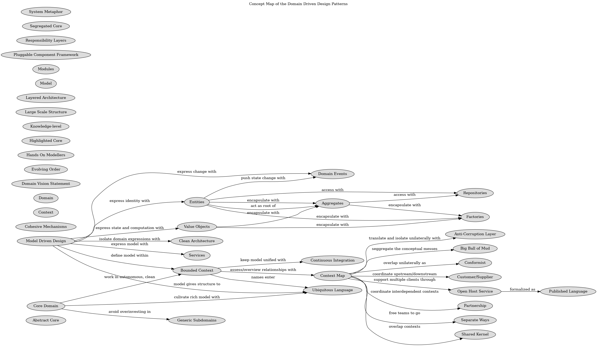

#Repositories (Concept)
## Description

## Documentation
Query access to aggregates expressed in the ubiquitous language.

Proliferation of traversable associations used only for finding things muddles
the model. In mature models, queries often express domain concepts. Yet queries
can cause problems.

The sheer technical complexity of applying most database access infrastructure
quickly swamps the client code, which leads developers to dumb-down the domain
layer, which makes the model irrelevant. 

Aquery framework may encapsulate most of that technical complexity, enabling
developers to pull the exact data they need from the database, but that only
solves part of the problem.

Unconstraint queries may pull specific fields from objects, breaching
encapsulation, or instantiate a few specific objects from the interior of an
aggregate, blindsighting the aggregate root and making it impossible for these
objects to enforce the rules of the domain model. Domain logic moves into
queries and application layer code, and the entities and value objects become
mere data containers.

Therefore,

For each type of aggregate that needs global access, create a service that can
provide the illusion of an in-memory collection of all objects of that
aggregate's root type. Set up access through a well-known global interface.
Provide methods to add and remove object, which will encapsulate the actual
insertion or removal of data in the data store. Provide methods that select
objects based on criteria meaningful to domain experts. Return fully
instanciated objects or collection of objects whose attribute values meet the
criteria, thereby encapsulating the actual storage and query technology, or
return proxies that give the illusion of fully instantiated aggregates in a
lazy way. Provide repositories only for aggregate roots that actually need
direct access. Keep application logic focussed on the model, delegating all
object storage and access to the repository.

## Concept Map

[Concept Map](../ddd/concept-view.md)

(generated with docs/concept.md.cmb)
